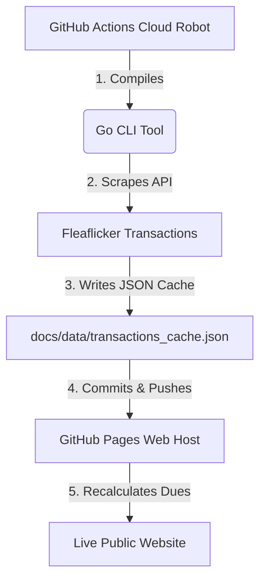

# Star Wars League - Dues & Transactions Tracker

Welcome to the **Star Wars League (ID 111626)** waiver dues tracking system. This project consists of a high-performance Go CLI tool and an interactive web dashboard that automates your league's waiver wire billing logic.

### 🌟 Dashboard Features & Visual Design
*   **Galactic Aesthetic:** Deep space backdrop with dynamic HTML5 canvas stars that accelerate to warp speed when changing seasons.
*   **Lightsaber Gradient:** Fluid color schema flowing from lightsaber Blue (Jedi) ➔ Purple (Mace Windu) ➔ Red (Sith).
*   **Division Groupings:** Dues leaderboard grouped into **Jedi**, **Sith**, and **First Order** divisions, with division headers using customized glows matching their lightsabers.
*   **Weekly Trend Sparklines:** Inline SVG sparklines displaying weekly pickups trends per franchise with hover tooltips.
*   **Standings Rank Indicators:** Pre-pended championship trophy (`🏆`) for the 1st overall seed and a toilet bowl peach (`🍑`) for the 12th place seed.
*   **Interactive Audits:** Click on any franchise name to view a detailed modal tracking base buy-ins, waiver claims, global costs, custom overrides, and a reverse-chronological transaction history grouped and color-coded by NFL weeks.

---

## 🚀 How the System Works (Auto-Updates)

The tracking site runs entirely serverless and updates automatically twice a day (at 8:00 AM and 8:00 PM UTC) through a four-stage cloud pipeline:



1.  **Cloud Trigger:** GitHub Actions (our cloud robot helper) executes the workflow script defined in `.github/workflows/sync.yml` on a scheduled timer.
2.  **Compilation & Sync:** The robot builds our compiled binary (`fleaflicker-cli`) and executes the `sync` command.
3.  **API Extraction:** The binary recursively downloads all waiver logs page-by-page from Fleaflicker, aggregates them, and writes the cache file directly to `docs/data/transactions_cache.json`.
4.  **Auto-Redeploy:** The robot pushes the cache updates back to the GitHub repository, prompting GitHub Pages to instantly redeploy and refresh the public site.

---

## 🛠️ Managing League Rules & Settings (config.json)

Because GitHub Pages serves static files, settings cannot be permanently saved directly from a visitor's web browser back to GitHub. To update league settings, payouts, shared food splits, or manual adjustments:

### Step-by-Step Configuration Update:
1.  **Open the Admin Tab:** Navigate to the **Admin Adjustments** panel on your live website.
2.  **Modify Values:** Edit parameters on-screen (e.g. buy-in amount, cost per pickup, first-place prize splits).
3.  **Add Global or Team Overrides:** 
    *   **Global shared dues** (e.g. food split or trophy cost) will be split equally among all teams automatically.
    *   **Team Adjustments** allow you to apply custom credits (e.g. negative values for injured player credits) or extra fees to a specific team.
4.  **Export Settings:** Click the **Export config.json** button at the bottom of the panel. This downloads your updated settings payload.
5.  **Commit the File:** Overwrite the `docs/data/config.json` file in your local directory with this downloaded file, then commit and push it to GitHub:
    ```bash
    git add docs/data/config.json
    git commit -m "Update league waiver dues config settings"
    git push
    ```
Within 30 seconds, the changes will be live for all league members.

*Note: Regular league members can play with values in their own browsers, but their edits are strictly client-side and will be discarded the moment they refresh their pages.*

---

## 💻 CLI Commands (Local Development)

You can run syncs and audits locally on your machine at any time using the Go binary.

### 1. Build the Binary
From the root of the project folder:
```bash
go build -o fleaflicker-cli
```

### 2. Synchronization
Pull the latest waiver history from Fleaflicker's servers and save it to the local cache:
```bash
./fleaflicker-cli -cache docs/data/transactions_cache.json sync
```

### 3. CLI Analytics
Review transaction stats and counts directly in your terminal:
```bash
./fleaflicker-cli stats
```

#### Optional CLI Filters:
*   Filter stats by year: `./fleaflicker-cli -year 2025 stats`
*   Filter stats by specific date: `./fleaflicker-cli -date 2025-12-19 stats`
*   Filter stats by team name: `./fleaflicker-cli -team "Jedi Mind Tricks" stats`
*   Query another league: `./fleaflicker-cli -league <id> standings`

---

## 🛡️ Rate Limiting & Cooldown Protection
The Fleaflicker API is protected by AWS WAF rate-limit rules. To prevent IP blocks during pagination, our Go client has two built-in safety mechanisms:
1.  **Sleep Throttling:** It waits `150ms` between sequential page fetches.
2.  **Exponential Backoff Retry:** If it encounters a WAF rate limit (HTTP 403 or 429), it automatically pauses, backing off progressively (`3s`, `6s`, `12s`, `24s`, `48s`) to let the block expire before automatically retrying, preventing execution failures.
